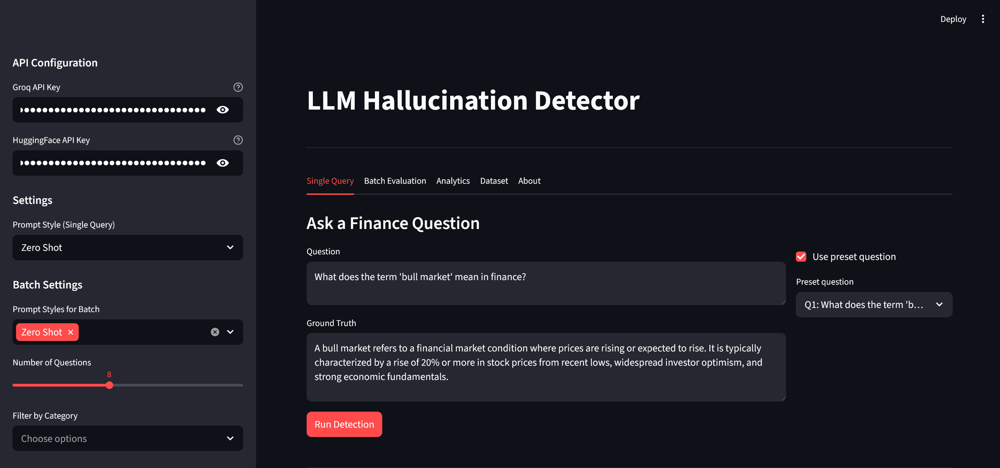
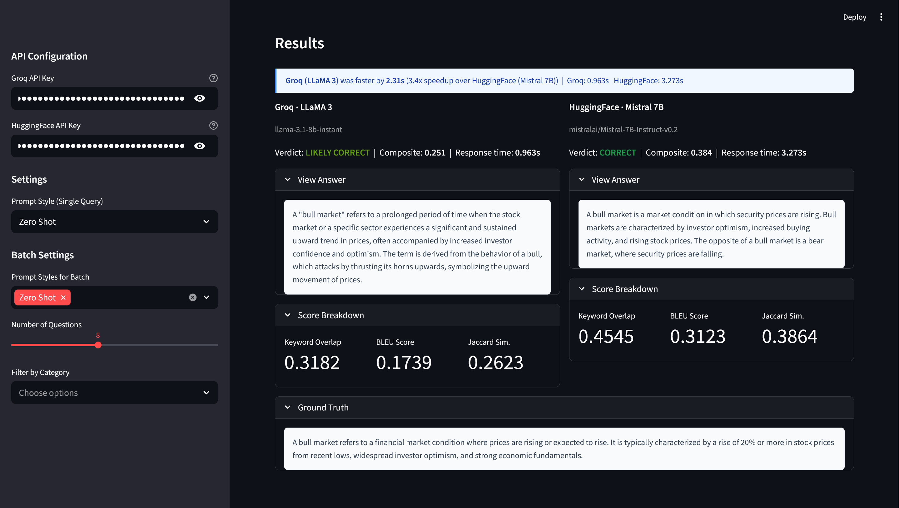
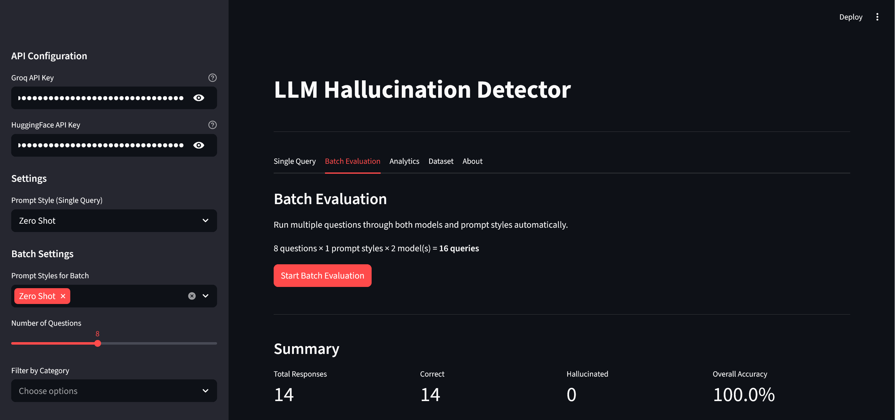
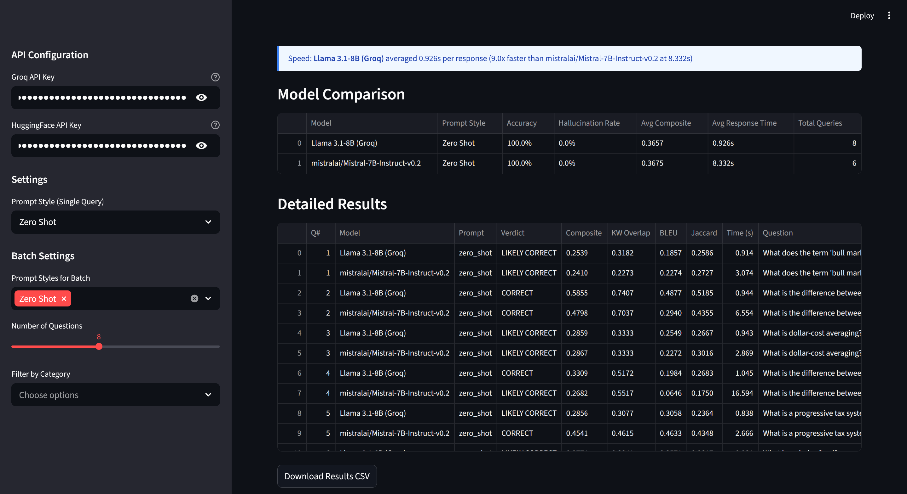
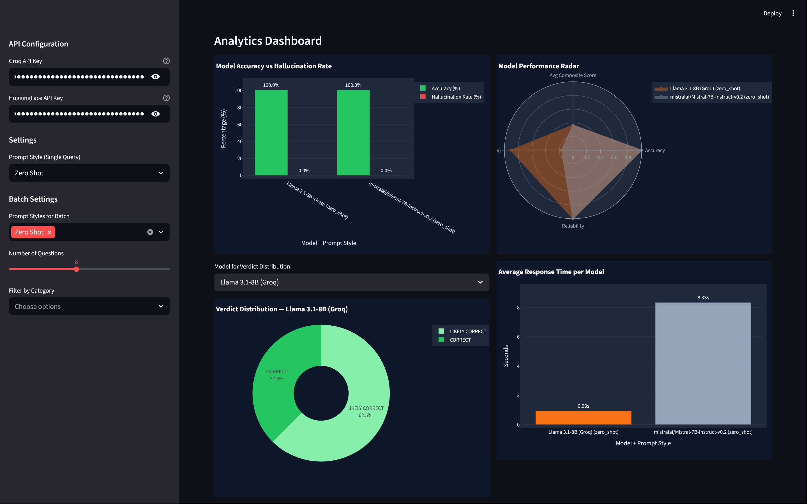
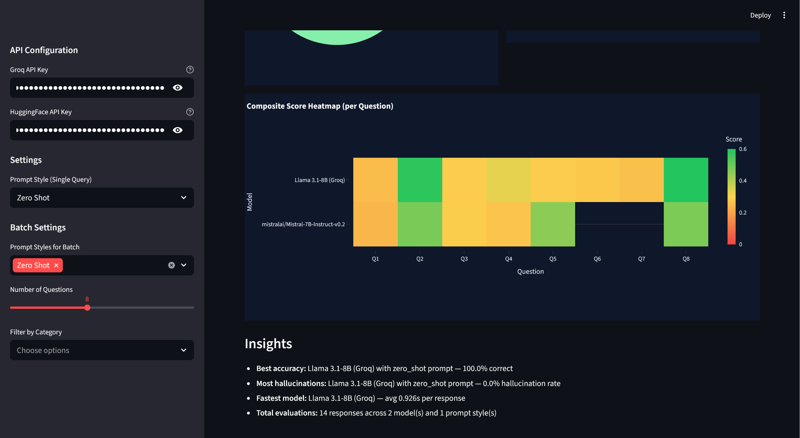

# 🧠 Comparative Hallucination Detection in LLM-based Question Answering

> **Using Gemini & Groq APIs | Finance Domain | Streamlit UI**

---

## 📌 Project Overview

This system detects hallucinations in answers generated by large language models (LLMs) and compares performance across:

- **Google Gemini 1.5 Flash**
- **Groq-hosted models**: LLaMA 3 (8B / 70B), Mixtral 8x7B

It evaluates 3 prompt strategies (Zero-Shot, Few-Shot, Chain-of-Thought) on a 15-question Finance QA dataset, classifying each response as **CORRECT**, **LIKELY CORRECT**, **LIKELY HALLUCINATED**, or **HALLUCINATED**.

---


## 📊 Dataset

15 finance questions across 8 categories:

- Stock Market · Economics · Investment · Banking
- Taxation · Financial Metrics · Monetary Policy
- Corporate Finance · Insurance · Cryptocurrency
- Personal Finance · Risk Management

---

## 📈 Features

- **Single Query Mode** — Test one question at a time, see side-by-side model answers
- **Batch Evaluation** — Run all questions × all prompt styles automatically
- **Analytics Dashboard** — Bar charts, radar charts, pie charts, heatmaps
- **Auto Insights** — Best/worst performing model and prompt automatically identified
- **CSV Export** — Download all batch results
- **Dataset Browser** — Browse and filter all Q&A pairs

---
## Interface






## 🔬 Detection Methodology

Each LLM-generated answer is compared to a ground truth answer using three complementary lexical similarity metrics:

| Metric | Weight | Description |
|--------|--------|-------------|
| **Keyword Overlap** | 35% | % of key reference terms present in the answer (stopwords removed) |
| **BLEU Score** | 35% | N-gram (1+2-gram) precision with brevity penalty |
| **Jaccard Similarity** | 30% | Token-level set overlap: \|A ∩ B\| / \|A ∪ B\| |

**Composite Score Thresholds:**

| Score Range | Classification |
|-------------|---------------|
| ≥ 0.30 | ✅ CORRECT |
| 0.18 – 0.29 | 🟡 LIKELY CORRECT |
| 0.10 – 0.17 | 🟠 LIKELY HALLUCINATED |
| < 0.10 | ❌ HALLUCINATED |

---

## 🧪 Prompt Strategies

### Zero-Shot
```
Answer the following finance question concisely and accurately.

Question: {question}

Answer:
```

### Few-Shot
Provides 2 finance-domain example Q&A pairs before asking the target question.

### Chain-of-Thought
Guides the model to think step-by-step:
1. Identify the core concept
2. Recall key definitions/principles
3. Provide a clear, accurate explanation

---

## ⚠️ Limitations

- Lexical metrics may under-score semantically equivalent paraphrases
- No semantic embeddings (e.g., SentenceTransformers) used — purely lexical
- Response times include network round-trip latency

---

## 🏗 Project Structure

```
hallucination_detector/
│
├── app.py                          # Main Streamlit application
│
├── data/
│   └── finance_qa.json             # 15 finance Q&A pairs with ground truth
│
├── models/
│   ├── __init__.py
│   └── llm_clients.py              # Gemini & Groq API clients + prompt templates
│
├── utils/
│   ├── __init__.py
│   ├── hallucination_detector.py   # Scoring: BLEU, keyword overlap, Jaccard
│   └── visualizations.py          # Plotly charts for the dashboard
│
├── requirements.txt
└── README.md
```

---

## ⚙️ Setup Instructions

### 1. Clone / Download the project
```bash
cd hallucination_detector
```

### 2. Install dependencies
```bash
pip install -r requirements.txt
```

### 3. Get API Keys
### 4. Run the app
```bash
streamlit run app.py
```

---


## 🛠 Tech Stack

```
Python 3.10+
Streamlit 1.35+
google-generativeai (Gemini API)
groq (Groq Python SDK)
Plotly 5.x
Pandas 2.x
```
